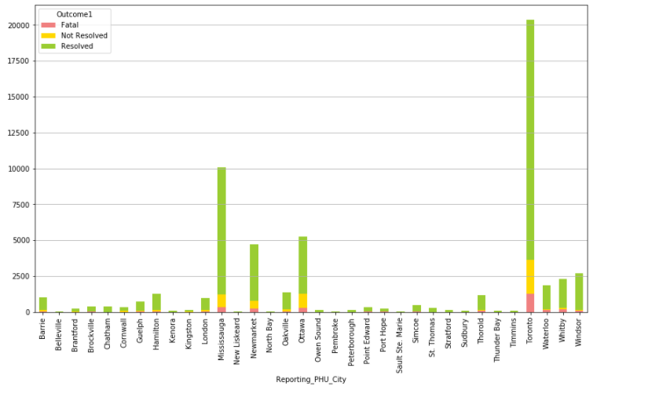

# covid-19
- This project was intended to provide updates on the current COVID-19 cases in Ontario. We have created an ARIMA time series model as well as daily updated visualizations on the current trend in Ontario.

# data source
- All of the data used for this project can be found [here](https://data.ontario.ca/dataset?keywords_en=COVID-19)

# Overview
- **Outstanding Cases By Age Group**

- **Outstanding Cases by Acquisition**

- **Outstanding Cases by Gender**

- **Outcome**

- **Outcome by Age Group**

- **Cases by City**
